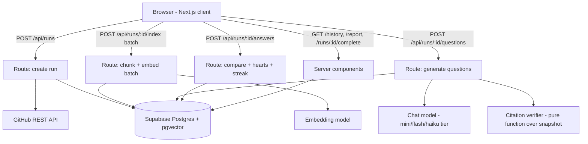

# Technical Design Document: ReadyPlayerOne MVP

## Executive Summary

**System:** ReadyPlayerOne | **Version:** MVP 1.0 | **Architecture:** Next.js App Router monolith with client-orchestrated pipeline stages over Supabase Postgres + pgvector | **Est. effort:** ~34 person-hours across a 24-hour window, two people working in parallel

**Interface:** a retro pixel-art game shell — left nav, repo selector, player HUD with hearts, streak, XP and levels — specified by the ten mockups, which are authoritative wherever they and this document disagree. Quizzes are five multiple-choice questions; see Decision 5 for why that changed.

Every decision below optimizes for one thing: a working end-to-end demo at hour 20, with four hours of slack. Where a more elegant option costs hours, the elegant option loses.

## Architecture Overview



The client is the orchestrator. It calls `/api/runs` once, then loops `/api/runs/:id/index` until the server reports the queue is drained, then calls `/api/questions`. This exists for one hard reason documented under Deployment: serverless functions have an execution ceiling and ingesting a repo does not fit inside it. Batching per request also gives the progress UI something real to display.

### Tech Stack Decision

Inherited from the starter repository and not up for debate — re-deciding these costs hours and buys nothing:

- **Frontend:** Next.js (App Router) + TypeScript + Tailwind CSS. Server Components for the report, Client Components for the quiz.
- **Backend:** Next.js Route Handlers. Same repo, same deploy, no second service.
- **Database:** Supabase Postgres, with the `vector` extension added by migration.
- **Auth:** Supabase Auth, already wired at `/login`. The template ships email OTP; accounts (P1) swap it for email and password to match the mockups. Optional for users — anonymous play is the demo path.
- **Hosting:** Vercel free tier.

Choices this document actually makes:

- **Vector store:** pgvector inside the existing Supabase database.
- **Models:** a hosted embedding model plus a mini/flash/haiku-tier chat model, accessed through a provider-agnostic SDK.
- **Retrieval:** line-aware fixed-window chunking with overlap, cosine similarity, run-scoped.
- **Validation:** Zod schemas on every route boundary and on every model JSON response.

#### Decision 1 — Vector storage

| Option | Pros | Cons |
|---|---|---|
| **pgvector in Supabase (recommended)** | Already provisioned; one migration to enable; joins directly against `chunks` metadata; free tier; no extra key or dashboard | Not tuned for very large indexes; index build needs thought if row counts grow |
| Dedicated vector DB (Pinecone/Qdrant-class) | Purpose-built, fast at scale | Another account, key, SDK, and failure mode at hour 3 for scale we will never reach |
| In-memory / JSON on disk | Zero setup | Dies on every serverless cold start; no cross-request persistence |

**Recommendation:** pgvector. At our caps a run produces roughly 300–800 chunks; exact nearest-neighbor scan inside a run partition is fast enough that we can skip approximate indexing entirely for the MVP. **Trade-off:** this would not hold at 100× the data, and we are explicitly not designing for that.

#### Decision 2 — Model access layer

| Option | Pros | Cons |
|---|---|---|
| **Provider-agnostic SDK (Vercel AI SDK-class) (recommended)** | Swap providers with a one-line change if a rate limit hits at hour 20; structured-output helpers; streaming built in | Thin abstraction layer to learn; occasional provider-specific feature gaps |
| Direct provider SDK | One less dependency; full access to provider-specific features | A rate limit or outage during judging means an emergency rewrite of every call site |
| Self-hosted / local model | Free, private | No GPU, no time, unacceptable latency on serverless |

**Recommendation:** the provider-agnostic SDK, with one provider primary and a second configured as an environment-variable swap. **Trade-off:** a small amount of indirection in exchange for surviving the most likely hour-20 failure. Pricing and free-tier limits change monthly — check the provider's current pricing page rather than trusting any figure here.

#### Decision 3 — Code chunking strategy

| Option | Pros | Cons |
|---|---|---|
| **Line-window chunks with overlap (recommended)** | Line numbers preserved exactly, which is the entire basis for citations; language-agnostic; ~40 lines of code | Can split a function across chunks; overlap costs some embedding spend |
| AST-aware chunking (tree-sitter-class) | Semantically clean boundaries | A parser per language, WASM loading in serverless, and hours of work — the classic hour-23 casualty |
| Whole-file chunks | Trivial to build | Citations degrade to "somewhere in this 600-line file", which guts the product's whole claim |

**Recommendation:** ~60-line windows with 10-line overlap, plus a whole-file chunk for files under 40 lines. **Trade-off:** occasionally split functions, mitigated by overlap and by retrieving the top 6 chunks rather than the top 1.

#### Decision 4 — Pipeline execution model

| Option | Pros | Cons |
|---|---|---|
| **Client-orchestrated batches (recommended)** | Each request stays well inside the serverless limit; progress is free; no queue infrastructure | The client must stay on the page during ingestion |
| Single long-running route | Simplest code | Exceeds the serverless execution ceiling on any real repo — it will time out |
| Background queue / worker (Inngest, QStash-class) | Survives navigation; proper retries | Another service, another key, another set of docs at hour 2 |

**Recommendation:** client-orchestrated batches. **Trade-off:** navigating away mid-ingestion abandons the run. Acceptable — ingestion is under 90 seconds and the progress screen gives users a reason to stay.

#### Decision 5 — Multiple choice versus free text

The mockups show four lettered options. The earlier draft of this document specified model-graded free-text answers. This is the largest change in the design, so it's worth stating why the mockups win.

| Option | Pros | Cons |
|---|---|---|
| **Multiple choice (recommended, per mockups)** | Scoring is a local integer comparison — no model call between questions, nothing to time out on stage; citations are verified once at generation instead of per answer; hearts, streak, and instant feedback all become possible; ~5x cheaper per quiz | Guessable at 25%; measures recognition rather than recall; distractor quality carries the whole burden of making it feel real |
| Free text, model-graded | Genuinely measures comprehension; ungameable; richer feedback | An 8-second model call between every question; a whole class of demo failures; grading disagreements are hard to defend to a judge |
| Both, user-selectable | Best of each | Two grading paths, two UIs, in 24 hours |

**Recommendation:** multiple choice. Beyond matching the mockups, it moves every expensive and failure-prone operation into generation, which happens once, behind a progress screen the player already expects to wait at. **Trade-off, stated plainly:** a player can guess their way to 25%, and recognition is a weaker signal than recall. The honest mitigation is distractor quality — wrong options that name real parts of this repository — not a difficulty slider. Free text survives as a P2 "hard mode" if this continues past the hackathon.

## Project Structure

Extends the starter repository's existing layout. Directories marked **new** are added by this project.

```
hackathon-app/
├── .claude/skills/worktree-pr/     # ships with the template — use it for agent changes
├── public/
│   ├── room.webp                   # new — the bedroom scene, one static image
│   └── fonts/                      # new — pixel display face + monospace face
├── src/
│   ├── app/
│   │   ├── layout.tsx              # new — game shell: left nav, top bar, player HUD
│   │   ├── page.tsx                # new — splash / repo entry
│   │   ├── login/                  # template ships OTP; swap to password (P1)
│   │   ├── signup/page.tsx         # new — Create Profile (P1)
│   │   ├── runs/[runId]/
│   │   │   ├── start/page.tsx      # new — confirm repo, quiz type, question count
│   │   │   ├── page.tsx            # new — ingest progress, redirects when ready
│   │   │   ├── quiz/page.tsx       # new — one question per screen + HUD
│   │   │   ├── complete/page.tsx   # new — score, mastery, breakdown, topics
│   │   │   └── answers/page.tsx    # new — answer review with citations
│   │   ├── history/page.tsx        # new — paginated run table
│   │   ├── report/page.tsx         # new — aggregate dashboard (P1)
│   │   └── settings/page.tsx       # new — profile + quiz preferences (P1)
│   │   └── api/
│   │       ├── runs/route.ts               # new — POST: create run, resolve SHA, fetch tree
│   │       └── runs/[runId]/
│   │           ├── index/route.ts          # new — POST: chunk + embed one batch
│   │           ├── questions/route.ts      # new — POST: generate the 5 questions
│   │           └── answers/route.ts        # new — POST: score answer, hearts, streak
│   ├── components/                 # new — shell: SideNav, RepoSelector, PlayerCard
│   │                               #       quiz: QuestionCard, OptionRow, Hearts,
│   │                               #             StreakPanel, ProgressPanel
│   │                               #       shared: Panel, PixelButton, CitationLink,
│   │                               #               MasteryBar, RunRow, Pager, TrendChart
│   ├── lib/
│   │   ├── supabase/               # ships with the template (browser + server clients)
│   │   ├── github/                 # new — url parsing, tree fetch, blob fetch, file filtering
│   │   ├── index/                  # new — chunking, embedding, retrieval
│   │   ├── quiz/                   # new — question generation, grading, citation verification
│   │   ├── identity/               # new — anon_id cookie issue/read, claim-on-sign-in
│   │   ├── progression/            # new — xp/level/mastery derivation, tier tables
│   │   ├── history/                # new — paginated run and report queries
│   │   └── schemas.ts              # new — Zod schemas for routes and model output
│   └── proxy.ts                    # ships with the template (session refresh)
├── supabase/
│   ├── config.toml                 # ships with the template
│   └── migrations/                 # new migrations added here; the demo todos table gets dropped
├── AGENTS.md                       # ships with the template — extend, don't replace
├── CLAUDE.md                       # ships with the template
└── .env.example                    # extend with model provider keys
```

## Data Model

Six tables plus one view. Written at hour 0 and changed as rarely as possible — schema churn mid-hackathon is a reliable way to lose two hours.

**`runs`** — one quiz attempt against one repo at one commit.
- `id` uuid PK default `gen_random_uuid()` (also the share token)
- `owner` text, `repo` text, `commit_sha` text, `default_branch` text
- `snapshot_run_id` uuid nullable → `runs(id)` — set when this run reuses another run's chunks
- `status` text — `pending | indexing | generating | ready | complete | failed`
- `question_count` int default 5, `difficulty` text default `mixed`
- `hearts_remaining` int default 3, `completed_at` timestamptz nullable
- `stage_detail` jsonb — files total, files indexed, chunk count, skipped counts, timings
- `error` text nullable
- `anon_id` uuid — the browser identity that created this run; always set
- `user_id` uuid nullable → `auth.users(id)` on delete set null
- `created_at` timestamptz default `now()`
- Unique index on `(owner, repo, commit_sha)` where `snapshot_run_id is null and status in ('ready','complete')` — the snapshot cache key.
- Index on `(anon_id, created_at desc)` and `(user_id, created_at desc)` — these back History, Report, and the HUD.

The cache key and the history key pull in opposite directions: a snapshot is shared across people and attempts, but a run belongs to one player. Keep them separate — a cached start creates a **new** run row for this `anon_id` pointing at the existing snapshot via `snapshot_run_id`, rather than handing the requester someone else's attempt. This is also exactly what Try Again needs, so retakes cost one row and zero embeddings.

**`chunks`** — line-aware slices of source, the retrieval corpus. Written only for snapshot runs.
- `id` uuid PK, `run_id` uuid → `runs(id)` on delete cascade
- `file_path` text, `start_line` int, `end_line` int, `content` text, `language` text
- `embedding` vector(1536)
- Index on `run_id`; index on `(run_id, file_path)`. No ANN index for the MVP — exact scan within a run partition is fast at this row count.

**`questions`** — five per run, multiple choice.
- `id` uuid PK, `run_id` uuid → `runs(id)` on delete cascade
- `order_index` int, `topic` text (`file_structure | core_logic | apis | testing | deployment`)
- `prompt` text
- `options` jsonb — array of exactly 4: `{ label, text, explanation, citation: { path, startLine, endLine }, verified: bool }`
- `correct_index` int (0–3)
- Unique on `(run_id, order_index)`.

Storing options, explanations, and citations together is what makes scoring a local comparison instead of a model call. Everything expensive happens once, at generation.

**`answers`** — one per question per run.
- `id` uuid PK, `run_id` uuid, `question_id` uuid → `questions(id)` on delete cascade
- `selected_index` int nullable (null = skipped), `is_correct` bool
- `streak_at_answer` int, `answered_at` timestamptz default `now()`
- Unique on `(run_id, question_id)`.

**`repo_files`** — the snapshot manifest that citation verification checks against.
- `id` uuid PK, `run_id` uuid → `runs(id)` on delete cascade
- `path` text, `line_count` int, `byte_size` int, `included` bool, `skip_reason` text nullable
- Unique on `(run_id, path)`.

**`profiles`** — P1, only needed once accounts exist.
- `id` uuid PK → `auth.users(id)` on delete cascade
- `username` text unique, `display_name` text, `avatar_key` text default `intern`
- `preferences` jsonb — question count, difficulty, show explanations, show code snippets, theme, accent
- `created_at` timestamptz default `now()`

**`verified_citations`** — a SQL view over `questions`, so the citation index stays in one place and can't drift from the quiz.

```sql
create view verified_citations as
select q.run_id, q.id as question_id, r.owner, r.repo, r.commit_sha, q.topic, q.prompt,
       o->>'label' as option_label,
       o->'citation'->>'path' as path,
       (o->'citation'->>'startLine')::int as start_line,
       (o->'citation'->>'endLine')::int as end_line,
       o->>'explanation' as why, r.created_at
from questions q
join runs r on r.id = q.run_id
cross join lateral jsonb_array_elements(q.options) as o
where (o->>'verified')::bool;
```

**Progression is derived, never stored.** XP, level, and totals come from one query over `answers` joined to this player's runs — 10 XP per correct answer, 25 per completed quiz, 100 XP per level. No counters to increment, no drift, and deleting a run silently corrects every number. The in-run streak comes from ordering the current run's answers by `order_index`. Nothing about the HUD needs its own table.

**Snapshot indirection:** because a cached or retaken run points at another run's chunks, every query against `chunks` and `repo_files` must use `effectiveSnapshotId = run.snapshot_run_id ?? run.id`, never `run.id`. Put that resolution in one helper in `lib/index/` and call it everywhere — retrieval, citation verification, and every snapshot lookup. Getting this wrong means cached runs retrieve nothing and generation silently degrades, which is an ugly bug to find at hour 19.

**Caching plan:** snapshots cached by `(owner, repo, commit_sha)`. A new attempt against a cached snapshot still regenerates its own questions — cheap (one model call), and it means a retake isn't the same five questions. If generation cost becomes a problem, copying questions is the fallback.

**RLS posture:** enable RLS on every table and grant the anon role **no** direct write access. All mutations go through route handlers using the service role key. Anon read is permitted on `runs`, `questions`, and `answers` filtered by `run_id`, safe because the id is an unguessable uuid — a capability URL. Two exceptions: `chunks` is never readable by anon (it holds full source text and there's no reason to serve it from our origin), and history queries scoped by `anon_id` run **server-side only**, reading the identity from the cookie, because the client must never be able to supply an `anon_id`. Drop the template's wide-open `todos` table and its policies in the first migration so no permissive demo policy survives into the submission.

**One caution on `questions`:** `correct_index` is readable by anyone holding the run id, which means a determined player can read the answers out of the network tab. For a hackathon this is fine and saying so is better than pretending otherwise. The real fix — serving options without the answer key and scoring server-side — is a 30-minute change if a judge asks.
## Feature Implementation

### Repository Ingestion — `POST /api/runs`

- **Request:** `{ repoUrl: string }`. **Response:** `{ runId, owner, repo, commitSha, fileCount, cached: boolean }`.
- Parse `owner/repo` from either a full URL or shorthand; reject anything that isn't GitHub with a specific message.
- `GET /repos/{owner}/{repo}` → default branch and existence check (404 covers both private and nonexistent — say so honestly in the error text rather than guessing which).
- `GET /repos/{owner}/{repo}/commits/{branch}` → pin the commit SHA. If a ready run exists for that SHA, return it with `cached: true` and stop.
- `GET /repos/{owner}/{repo}/git/trees/{sha}?recursive=1` → full tree.
- **Filtering, in order:** drop by directory (`node_modules`, `dist`, `build`, `.next`, `vendor`, `target`, `.git`); drop by extension (binaries, images, fonts, media); drop lockfiles and anything matching `*.min.*`; drop files over 100KB. Then rank what remains — README and manifests first, then config and entry points, then source by shallowest path — and keep the top **60 files or 400KB**, whichever binds first. Write every file to `repo_files` with `included` and `skip_reason` so the UI can report what was skipped and the verifier knows the snapshot's exact boundaries.
- **Business rules:** a repo with fewer than 5 included source files fails the run with a clear message rather than generating a hollow quiz.
- **Side effects:** run row created with `status = 'indexing'`.

### Chunk + Embed Batch — `POST /api/runs/:runId/index`

- **Request:** `{ batchSize?: number }` (default 8 files). **Response:** `{ filesIndexed, filesRemaining, chunkCount }`.
- Fetch the next unindexed included files' blobs, decode base64, normalize line endings, record `line_count` on `repo_files`.
- Chunk: files under 40 lines become one chunk; otherwise 60-line windows with 10-line overlap. **`start_line` and `end_line` are 1-based and must match the source exactly** — every citation in the product depends on this, so it gets a unit test.
- Embed the batch in one embedding call, insert chunks, update `stage_detail`.
- The client calls this repeatedly until `filesRemaining` is 0, rendering progress from the response.
- **Failure handling:** a failed batch is retried once by the client, then the run continues with whatever indexed successfully if at least 70% of files made it; otherwise the run fails.

### Question Generation — `POST /api/runs/:runId/questions`

- Build a repo map from `repo_files` plus the manifest files: directory tree (depth-limited), detected stack, declared dependencies, candidate entry points.
- Retrieve grounding per topic, not globally: five fixed probe queries — one each for file structure, core logic, APIs, testing, deployment — so the deployment question isn't generated from the same README chunk as the file-structure one.
- One model call per quiz, structured JSON validated by Zod: five questions, each with `topic`, `prompt`, four `options`, `correct_index`, and per-option `explanation` plus a `citation` naming path and line range.
- **The distractor prompt is the part that decides whether this product feels real.** Require every wrong option to name something that genuinely exists in this repository — a real directory, real module, real tool from the dependency list — so the wrong answers are wrong about *this* codebase rather than obviously fake. Pass the file tree and dependency list explicitly for this purpose. Budget the most prompt-iteration time here; it's where a generic quiz and a convincing one diverge.
- Verify every citation (below). Options failing verification have their citation stripped and `verified: false` set. If the **correct** option's citation fails, regenerate that question once; if it fails again, fail the run rather than shipping an uncited answer key.
- **Business rules:** reject and retry once on fewer than five questions, a duplicated topic, a missing `correct_index`, or fewer than four options. On a second failure, fail loudly — generic filler is worse than an error.
- **Side effects:** run status → `ready`.

### Answering — `POST /api/runs/:runId/answers`

No model call. This route is a comparison and two writes.

- **Request:** `{ questionId, selectedIndex }`. **Response:** `{ isCorrect, correctIndex, explanations, heartsRemaining, streak, xpAwarded }`.
- Compare `selectedIndex` to the stored `correct_index`. Insert the answer with `is_correct` and the streak value at that moment.
- On a wrong answer, decrement `runs.hearts_remaining`. At zero, set `status = 'complete'` and `completed_at`, and the client routes to Quiz Complete with the questions answered so far — a short run, not a lost one.
- On the last question, set `status = 'complete'` and `completed_at`.
- Idempotent per `(run_id, question_id)`: a resubmission returns the existing answer rather than re-scoring, so a double-tap or refresh can't drain hearts.
- **Latency:** single-digit milliseconds. This is the main reason multiple choice is the right call for a 24-hour build — the original free-text design put an 8-second model call between every question and the next screen, five times per quiz, each one a chance to time out on stage.

### Citation Verification — `src/lib/quiz/verify.ts`

A pure function, no model, no network. This is the differentiator, so it's the one piece that gets real tests. It now runs at **generation** time rather than grading time, which means a bad citation never reaches a player at all.

A citation survives only if all four hold:
1. `path` exists in `repo_files` for the effective snapshot with `included = true`.
2. `1 ≤ startLine ≤ endLine ≤ line_count` for that file.
3. The span overlaps at least one chunk that was in the retrieval set for that question — the model cannot cite source it was never shown.
4. The span is under 80 lines, so "the whole file" cannot masquerade as evidence.

Survivors render as `path:start–end`, linking to `https://github.com/{owner}/{repo}/blob/{commit_sha}/{path}#L{start}-L{end}`. Pinning to the SHA rather than the branch means the link still points at the exact lines after the repo moves on.

### Progression — `src/lib/progression/`

One query, no tables:

```sql
select count(*) filter (where a.is_correct) as correct,
       count(distinct r.id) filter (where r.completed_at is not null) as quizzes
from answers a join runs r on r.id = a.run_id
where r.anon_id = $1 or r.user_id = $2;
```

`xp = correct * 10 + quizzes * 25`, `level = floor(xp / 100) + 1`, level names by a static tier table ("Getting Oriented", "Finding Your Way", …). Cache it per request in the layout so the HUD doesn't re-query on every screen.

### Identity — `src/lib/identity/`

- On any request without an `rpo_aid` cookie, issue one: a v4 uuid, `httpOnly`, `sameSite=lax`, `secure`, one-year expiry. `proxy.ts` already runs on every request for Supabase session refresh, so issuing the cookie there is the cheapest hook and guarantees the id exists before the first run.
- Every run stamps `anon_id` from that cookie, plus `user_id` when a session exists.
- **Claim on sign-in:** after successful authentication, a server action runs `update runs set user_id = $uid where anon_id = $aid and user_id is null`. Cheap, idempotent, and signing in never appears to erase history.
- **Auth method change:** the mockups show email + password with a Create Profile form, not the magic-link OTP the starter template ships. Supabase supports `signUp`/`signInWithPassword` directly; swapping the two `/login` calls and adding `/signup` is roughly 20 minutes. Do it when you build accounts, not before — anonymous play is the demo path.
- **Known limitation, stated rather than solved:** clearing cookies or switching browsers loses anonymous history. Signing in is the fix, and the empty state says so. Device-independent anonymous identity is not a 24-hour problem.

### History — `/history`

A Server Component reading the cookie. No API route, no client fetching, no loading state.

- **Pagination:** `?page=n`, 10 rows per page, `limit 10 offset (n-1)*10` plus a count for the pager. Offset pagination is right here; cursor pagination is strictly better at scale and strictly more work, and nobody in this hackathon will have 500 runs.
- Each row: rank number (trophy on the best score), repo, date and time, `n/5` with percentage, mastery tier, View Results.
- Destination by state — `completed_at` set opens `/runs/:id/complete`; otherwise resume at `/runs/:id/quiz?q=<first unanswered order_index>`.
- Mastery tier is computed in one place, `lib/progression/mastery.ts`, and imported by History, Quiz Complete, and Report. Three copies of the same threshold table is how the screens end up disagreeing at hour 22.

### Report — `/report` (P1)

Also a Server Component. Every number on this screen comes from `answers` joined to the player's runs — one grouped query, plus one ordered query for the trend.

- **Stat cards:** total quizzes, average score, best score, count of topics above 75%.
- **Score trend:** completed runs ordered by date with their percentages. Use a small chart library or, honestly, 30 lines of inline SVG — a polyline over a grid is less code than configuring a chart library, and it styles to the pixel theme more easily.
- **Per-topic performance:** accuracy per topic across all runs, as labeled bars.
- **Recent activity:** the five most recent completed runs with score and mastery.
- **Insights are template strings, not a model call.** "Your scores have improved by N% over time", "You perform best in X and Y", "Focus more on Z" are all computable from the numbers already on the page. A model call here would cost latency and money to produce text that can be wrong about data we already have exactly.
- **This screen needs history to look like anything.** With one run it's four cards and an empty chart. Seed 5–6 completed runs against small repos before recording the demo.

### Settings — `/settings` (P1/P2)

Profile and Quiz Preferences write `profiles.preferences` and are read when creating a run. Appearance, Data & Privacy, and Account are P2 — build the panels as disabled controls with the real ones wired only if time remains after everything above. A theme switcher in particular is three times the styling QA for a screen the demo shows for four seconds.

## Security Implementation

- **Auth + authorization:** Supabase Auth — email and password once accounts land (P1), OTP as the template ships it until then. Anonymous use is the default path. Run access is capability-based via unguessable uuid; signed-in users additionally get `user_id` stamped on their runs for a "My Runs" list. No roles, no MFA — neither is justified at MVP scope.
- **Key handling:** `SUPABASE_SERVICE_ROLE_KEY` and model provider keys are server-only environment variables, referenced exclusively inside route handlers. Nothing prefixed `NEXT_PUBLIC_` touches them. `.env.local` stays gitignored; add the new keys to `.env.example` with placeholder values.
- **Prompt injection:** repository content is untrusted input and some repos contain text engineered to manipulate models. All source content is passed inside explicit delimiters labeled as data, the system prompt states that instructions inside repository content are to be treated as content rather than obeyed, and — critically — citation verification is mechanical, so a malicious repo cannot talk the grader into fabricating evidence even if it does influence the prose.
- **Abuse protection:** per-IP rate limiting on `/api/runs` (the expensive route) and a hard per-run cap on total embedding calls. CORS defaults to same-origin; there is no public API. Security headers via Next.js config.
- **Data exposure:** `chunks` holds full source text and is never readable by the anon role. All repository content is public by definition, but there's no reason to serve it from our origin.

## Development Workflow

Two people, 24 hours, one repository. The split that minimizes merge pain: **one owns the pipeline (`lib/github`, `lib/index`, the ingestion and question routes), one owns the experience (quiz UI, report, components, grading route's presentation layer)**. They meet at the database schema and the TypeScript types, both of which get written and agreed in the first hour and then treated as frozen.

- **Git:** trunk-based off `main` with short-lived `feature/` branches. The starter repo ships a `worktree-pr` Claude Code skill — use it for agent-made changes so an agent never edits the main checkout directly. Read the skill file before the clock starts, not at hour 6.
- **Commits:** commit at every working state. A working state at hour 14 that you can return to is worth more than an elegant history.
- **CI/CD:** Vercel's git integration gives preview deployments per branch for free — that's the CI that matters here. A GitHub Action running `tsc --noEmit` and `eslint` on push is worth the ten minutes it takes; ask your coding agent to generate it.
- **Checkpoint gates:** deploy to Vercel at hour 4 (before there's anything to demo) rather than at hour 20. Deployment bugs found at hour 20 are the classic way to lose a hackathon.

## Testing Strategy

Test coverage is a spend decision under a 24-hour clock. Spend it where a silent failure would be fatal and manual testing wouldn't catch it.

- **Unit tests (write these):** the chunker's line-number arithmetic, including files with trailing newlines, CRLF, and fewer lines than the window; the citation verifier against every one of its four rejection cases; GitHub URL parsing. These are pure functions, fast to test, and both are load-bearing for the entire product claim.
- **Integration (one test):** a fixture repo tree through filter → chunk → verify, with no network, asserting that every produced chunk's line range matches the fixture source.
- **Manual, scripted (the rest):** a written checklist run at hour 18 across three repositories of different languages and sizes, covering every error state in the PRD's Definition of Done.
- **Verification discipline:** for any UI change, render it and look at it before committing. For a frontend-heavy 3-minute demo, a visual regression nobody noticed is the expensive bug.
- **No E2E framework.** Setting up Playwright costs more hours than it saves at this scale.

## Deployment

**Path:** push to `main` → Vercel builds and deploys. Preview deployments on branches. Supabase is already hosted; migrations applied via `npx supabase db push --linked`.

**Environment variables** (set identically in `.env.local` and the Vercel dashboard): the three Supabase values from the starter template, plus the model provider key(s) and an optional `GITHUB_TOKEN`.

**The constraint that shapes the architecture:** Vercel's free tier caps how long a serverless function may run, and that ceiling is the reason ingestion is batched rather than done in one request. Confirm the current limit on Vercel's docs before building and size the index batch so a batch finishes in roughly half of it. If a batch of 8 files runs long on large files, lower the batch size — it's a single constant.

**A `GITHUB_TOKEN` is strongly recommended.** Unauthenticated GitHub API requests are rate-limited per IP, and on Vercel that IP is shared. A classic personal access token with no scopes raises the limit substantially and takes two minutes to create. Discovering this limit during judging is a bad way to discover it.

**Warm the demo repos before submitting** — run each seeded repository through ingestion on production so the cache is populated and the demo starts in seconds.

## Cost Analysis

Everything here targets the $0–$10 budget. Verify each figure on the vendor's current pricing page — these change monthly and nothing below is a quote.

| Service | Tier | Expected cost |
|---|---|---|
| Vercel | Hobby | $0 |
| Supabase | Free | $0 |
| GitHub API | Public, token-authenticated | $0 |
| Embeddings | Small/mini-tier hosted model | Cents per snapshot at our caps; zero on cached repos and retakes |
| Chat model | Mini/flash/haiku tier | **One generation call per quiz. Zero per answer.** |

Moving to multiple choice cut per-quiz model spend by roughly 80% — the free-text design made nine calls per quiz, this makes one. Combined with snapshot caching, a demo session of twenty retakes against three repos costs almost nothing.

**The cost lever that matters:** snapshot caching by commit SHA. Set a hard per-run embedding call cap in code so a pathological repo can't quietly drain credits.

## AI Features

ReadyPlayerOne is AI-powered at exactly one point in the pipeline, which is a strength worth saying out loud to judges: everything the player sees after generation is deterministic.

- **Use cases:** embedding for retrieval, and one structured generation call producing five questions with options, explanations, and citations.
- **Not AI:** scoring, hearts, streak, XP, mastery tiers, and every number on the Report screen, including the insight sentences. All computed. None of it can hallucinate.
- **Data sensitivity:** public repository source code only. No PII beyond an optional email at sign-up. Tell users in one line on the home screen that repo content is sent to a model provider.
- **Provider options:** hosted API only — local models are infeasible on serverless. Primary chosen at build time by available credits; secondary configured as an environment-variable swap.
- **Latency and cost targets:** generation ≤ 25s behind the ingestion progress screen; answering has no model latency at all. Hard cap on embedding calls per run.
- **Fallback on AI failure:** generation retries once, then fails the run with a specific message and the run never reaches `ready`. A question whose correct option loses its citation to verification is regenerated once, then fails the run. **Nothing in this system ever displays an unverified citation or a score it didn't compute itself, in any failure mode.** That rule is the product.

## Build Sequence (24 Hours)

The mockups add roughly ten hours of UI to a plan that had thirty minutes of slack. What follows is what actually fits. Hours are approximate; the checkpoints and the tier boundaries are not.

| Hours | Work | Checkpoint |
|---|---|---|
| 0–2 | Template cloned, Supabase project, migration (6 tables + view, `todos` dropped), types agreed, fonts and room asset exported, both running locally | Schema frozen, art assets in `public/` |
| 2–5 | GitHub ingestion + filtering + `repo_files`; game shell (left nav, top bar, HUD with placeholder numbers) | Paste a URL, see a real file list inside the real shell |
| 4 | First Vercel deploy, env vars set | **Deployed before there's anything to demo** |
| 5–8 | Chunking + embedding + batch route + staged progress screen; chunker unit tests | Run reaches `ready` with correct line numbers |
| 8–12 | Question generation: per-topic probes, distractor prompt iteration, citation verification + its tests | Five convincing, cited questions about an unfamiliar repo |
| 12–15 | Quiz play: options, hearts, streak, answer route, resume | Full five-question loop with stakes |
| 15–17 | Quiz Complete + Answer Review with citations | The two screens the video ends on |
| 17–19 | History with pagination; progression derivation wired into the HUD | Real XP, real levels, real history |
| 19–21 | **Styling pass against the mockups, screen by screen** | It looks like the mockups, not like Tailwind defaults |
| 21–22 | Error states, mobile fallback, seed and warm demo repos, manual checklist | Three repos pass end to end |
| 22–23.5 | Demo script, record video under 3 minutes, Devpost write-up | Submitted |
| 23.5–24 | Buffer | — |

**What this schedule does not contain:** the Report dashboard, accounts, the splash screen, and Settings. They are P1 in the PRD and they are genuinely good screens — they are also four hours that do not exist. Build them in that order with whatever time hours 19–21 give back, and be willing to ship without them. A judge will not deduct for a missing settings page; they will deduct for a quiz that breaks.

**Cut list, in order, if you're behind at hour 15:** the Report dashboard, then accounts and the splash (anonymous play demos identically), then Settings, then the mobile fallback (demo on a laptop), then History pagination (show the ten most recent, no pager), then the HUD's XP bar (keep hearts and streak — they're on the quiz screen and they carry the game feel). **The last things standing are the quiz loop and citation verification.** Without verification this is a chatbot generating trivia, and that is the entire difference between this and every other submission.

**A note on the art.** Hours 19–21 are not polish, they're a scored deliverable — the mockups are the strongest thing this project has going into judging, and a half-styled version of them looks worse than a plain UI honestly built. Protect those two hours. If you're behind, cut a feature, not the styling pass.

## Maintenance

- Keep dependencies at whatever the starter template ships; upgrading anything during the build window is unpaid risk.
- Model and provider pricing changes monthly — re-check before any post-hackathon continuation.
- If this continues past the hackathon: extend the repo's existing `AGENTS.md` and `CLAUDE.md` with the schema and route conventions above rather than writing new instruction files, and revisit the RLS posture before any non-capability-URL sharing model is added.

## Open Questions

| # | Question | Owner | Needed by |
|---|---|---|---|
| 1 | TBD — What is the actual judging rubric and its weights? The deck's rubric link was unfilled. | Chawana | Before hour 19 styling decisions |
| 1b | TBD — Where does the room background asset come from, at what resolution, and is it licensed for submission? Everything renders on top of it. | Both | Hour 0 |
| 2 | TBD — Which model provider has usable free credits at build time, and what is its rate limit? | Both | Hour 0 |
| 3 | TBD — What is Vercel Hobby's current function execution ceiling, and what batch size fits in half of it? | Pipeline owner | Hour 5 |
| 4 | TBD — Which 2–3 repositories are seeded as demos, and are any of them the organizers' own? | Both | Hour 19 |
| 5 | TBD — Do the 60-file / 400KB caps produce good questions on a large monorepo, or do they need per-repo tuning? | Pipeline owner | Hour 11 |

---
*Version 1.0 | Last updated: September 11, 2026 | Next review: post-hackathon | Technical lead: Chawana*

---
## Handoff Context
<!-- Machine-readable summary for the next workflow step. Do not delete; the next prompt in the workflow reads this block. -->
- Stage: techdesign
- App name: ReadyPlayerOne
- User level: B  (A = vibe coder, B = developer, C = in-between)
- Target platform: web (responsive)
- Budget: $0–$10, free tiers only
- Timeline: 24-hour hackathon, single build window
- Chosen stack: Next.js App Router + TypeScript + Tailwind / Next.js Route Handlers / Supabase Postgres + pgvector + Auth / Vercel
- Quiz format: 5 multiple-choice questions across 5 topics, deterministic scoring, citations verified at generation
- UI: pixel-art game shell from 10 mockups — left nav, repo selector, HUD (hearts, streak, XP, level)
- AI coding tool: Claude Code (repo ships a worktree-pr skill) with Cursor as alternate
- Source files: PRD-ReadyPlayerOne-MVP.md → TechDesign-ReadyPlayerOne-MVP.md
---
